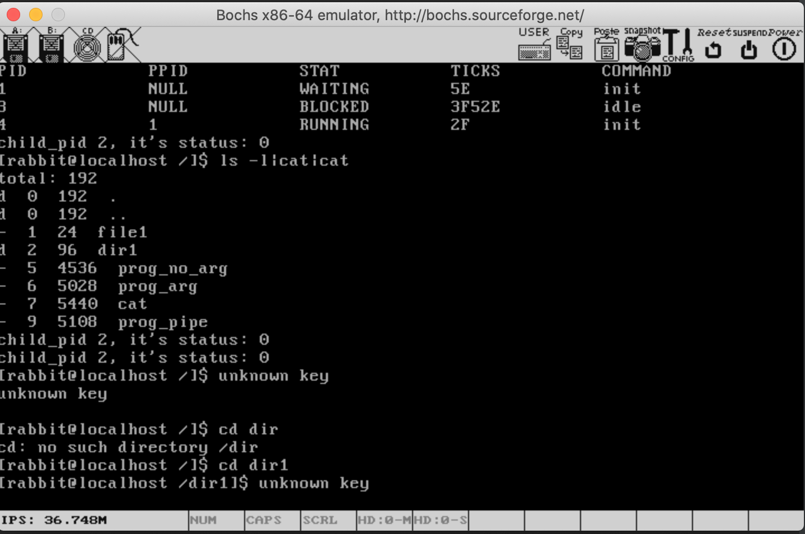
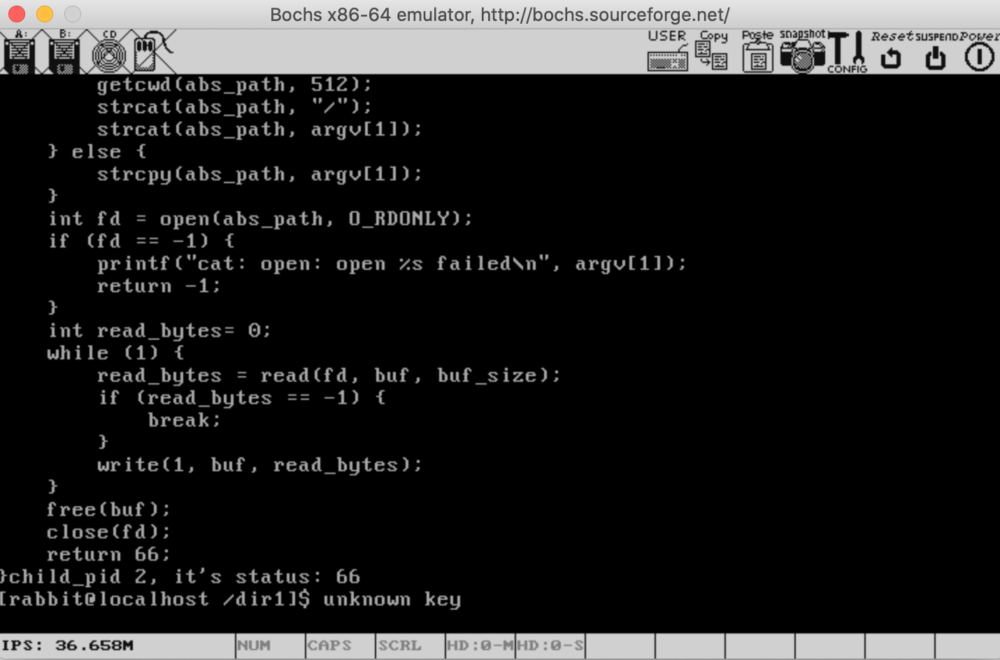

# 操作系统真象还原学习代码(Mac 环境)

https://book.douban.com/subject/26745156/

书中使用的是 ubuntu 的环境，以下是在 mac 上实验工具。

## mac工具

```
# 编译工具
brew install bochs
brew install i386-elf-gcc
brew install i386-elf-binutils
# gcc 替换为 x86_64-elf-gcc 并加上 -m32 参数
# 例如
# x86_64-elf-gcc -m32  -Wall -c -fno-builtin -W -Wstrict-prototypes -Wmissing-prototypes -Wsystem-headers -I ../lib/ -I ../lib/user -I ../fs prog_arg.c -o prog_arg.o
#
# ld 替换为 x86_64-elf-ld 并加上 -melf_i386 参数
# 例如
# x86_64-elf-ld -melf_i386 prog_arg.o simple_crt.a -o prog_arg 
#
# ar 替换为 x86_64-elf-ar
```

```
# 创建硬盘
bximage -hd=60M -mode=create hd60M.img
bximage -hd=80M -mode=create hd80M.img
```

```
# mac中， fdisk命令与 linux 中不一样，所以磁盘分区，使用 docker 的方式
docker run -v yourdir:/test -it --rm busybox:ubuntu-14.04 sh
```

## 效果图



